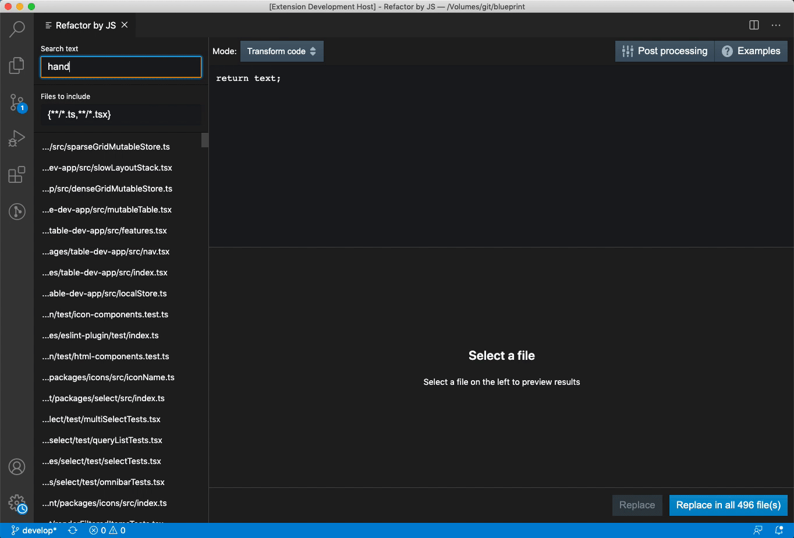

# Refactor by JS

Allows you to bulk refactor your code by writing javascript transformations that run over your source code, with a live preview of the results.

You can either write javascript that transforms the text:



Or transforms the underlying abstract syntax tree:


To run, open the command palette and execute the `Refactor by JS` command. 

#### Development

Run:

```
yarn install
yarn run build
```

And then press F5 in vscode, and in the new vscode window that launches, run the `Refactor by JS` command.
